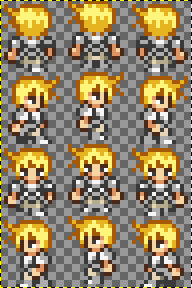
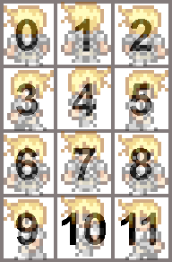

***************************
Chapter 2 - World Authoring
***************************

While Tsunagari doesn't yet include a comprehensive world editing suite, it is certainly possible to create an original game world. The process of manual world authoring isn't overly difficult, but requires a somewhat intimate understanding of some simple game data formats.

This chapter covers the procedures for creating a Tsunagari game world from scratch. It is intended for the tech-savvy user who doesn't mind getting their hands a bit dirty. Manual world authoring is not recommended for the common end-user; it requires a basic understanding of XML and other various file formats, and some manual file editing.

Anatomy of a World File
=======================

The Tsunagari Tile Engine is an interpreter for "world files", self-contained packages which consist of game data. World files themselves are simply zip archives with a ".world" file suffix. Inside these packages are several kinds of data, which together describe a game world. The different kinds of data files found inside a game world are described below.

World File Contents
-------------------

* World Descriptor: An XML file which must be named "world.conf", and must be present in the root directory of a world file. This file contains the base settings needed for the engine to initialize a game world.
* Player Descriptor: An XML file, of which exactly one must be present in a world file. This file contains initial settings for the player character, including movement speed, sprite data, and sound effects.
* NPC Descriptors: XML files, which contain the initial settings for a non-player-character, including movement speed, sprite data, and event script references for its AI.
* Audio Files: OGG Vorbis format audio files, with a ".oga" file suffix. These files contain sound effects and music.
* Tile/Sprite Sheets: PNG or JPEG format image files. Each of these files contain a sheet of tile graphics or sprite frames.
* Area Descriptors: XML files with a ".tmx" file suffix, which follow the TMX Map Format specification. Each of these files describe a single game world area. They are authored with the Tiled Map Editor, the use of which is described in a later chapter.
* Event Scripts: Python scripts which utilize the Tsunagari Event Scripting API to create dynamic game events. Event scripting is covered in a later chapter.

World Descriptor
================

The world descriptor is an XML file which must be named “world.conf” and must be present in the root directory of a world file. This is the first file that the Tsunagari Tile Engine looks for when loading a game world; it contains the configuration values needed to initialize the game. It includes settings such as information about the game, starting location for the player, initialization scripts, and input configuration.

Example World.conf (from Testing World)
---------------------------------------

::

   <?xml version="1.0" encoding="UTF-8" ?>
      <world>
      <info>
         <name>Testing World</name>
         <author>OmegaSDG</author>
         <version>1</version>
      </info>
      <init>
         <area>areas/grove01.tmx</area>
         <player>entities/player/player.xml</player>
         <mode>tile</mode>
         <coords x="5" y="3" layer="0" />
         <viewport width="160" height="160" />
      </init>
      
      <input>
         <persist init="300" cons="100" />
      </input>
   </world>

That looks a little complicated. Let's break it down:

* The very first line is an instruction to the XML parser, which gives information about how the file should be processed. This line should be at the top of every XML file in the game world, and probably shouldn't be modified.
* The ``<world> </world>`` tags state that this file is a world descriptor. These are **required** at the beginning and end of world.conf.
* The ``<info> </info>`` tags denote the info section of world.conf. This section is **required**, and contains general information about the game world.

   * ``<name>Testing World</name>`` states that the name of the game world is "Testing World".
   * ``<author>OmegaSDG</author>`` states that this game world was written by "OmegaSDG".
   * ``<version>1</version>`` tells Tsunagari the version of the game world. This value isn't used yet, but is still required.

* The ``<init> </init>`` tags denote the init section of world.conf. This section is **required**, and contains information used for initializing the game.

   * ``<area>areas/grove01.tmx</area>`` gives the location of the starting area inside the world file. This area loads first, and the player is inserted here when the game starts.
   * ``<player>entities/player/player.xml</player>`` gives the location of the player entity descriptor, which is described in a later section.
   * ``<mode>tile</mode>`` states that this game is a "tile" mode game. Currently supported modes are "tile" and "turn". More game modes will be supported in the future. See the appendix for more information.
   * ``<coords x="5" y="3" layer="0" />`` states that the player will be inserted into the starting area at tile coordinates 5 by 3, on layer 0.
   * ``<viewport width="160" height="160" />`` states that the game window will scale to show at most 160 pixels of width and 160 pixels of height for each area. If the game's tiles are 16x16 pixels, then the window will show an area of 10 tiles by 10 tiles.

* The ```` tags denote the script section of world.conf. This section is **optional**, and contains the locations of event scripts to be run at certain times.

   * ``<on_init>init.py</on_init>`` gives the location of an event script to be run when the game is first started.
   * ``<on_area_init>everyArea.py</on_area_init>`` gives the location of an event script to be run when each area is loaded.

* The ``<input> </input>`` tags denote the input section of world.conf. This section is **optional**, and contains input handling settings.

   * ``<persist init="300" cons="100" />`` states that in "turn" mode, when a direction button is held for 300 milliseconds, the player should continue to move in that direction every 100 milliseconds until the button is released. This value is required in "turn" mode only.

Tile and Sprite Sheets
======================

Tile and sprite sheets are PNG (or JPEG) image files containing either tile graphics or sprite frames. Both kinds of sheets follow the same format, and are in fact interchangeable, differing only in context. The sub-images in a sheet are referenced by their position in the sheet, starting at zero and counting left-to-right, then up-to-down. Sheets use the alpha channel instead of a predetermined background color to denote transparency.

As an example, this is the player sprite sheet for Tsunagari's testing world. The sheet contains twelve 16x18 pixel frames, which correspond to the player's direction and movement. It has been enlarged at 400% to increase clarity.

To illustrate sheet positioning, here is the same sheet overlayed on a numbered chart to show sheet coordinates as they are referenced by the Tsunagari Tile Engine.

Tile sheets are used to insert tile graphics in the Tiled Map Editor, and sprite sheets are used in entity descriptors when defining player and entity graphics phases.

Entity Descriptors
==================

Entity descriptors are XML files that define the properties of a Tsunagari entity. An entity is a game object which is capable of movement through a game area. There are three kinds of entities:

* Player
* NPC
* Overlay

Each of these use the same entity descriptor format. The entity descriptor contains information about an entity's graphics, sounds, event triggers, and default values. It is used when an entity is inserted into an area via event scripting. Entity insertion is discussed later.

Example Entity Descriptor (Player Entity from Testing World)
------------------------------------------------------------

::

   <?xml version="1.0" encoding="UTF-8" ?>
   <entity>
      <speed>2</speed> <!-- movement speed in tiles per second -->
      <sprite>
         <sheet tile_width="16" tile_height="18">entities/player/player.png</sheet>
         <phases>
            <phase name="down" pos="7" />
            <phase name="down-left" pos="7" />
            <phase name="left" pos="10" />
            <phase name="up-left" pos="1" />
            <phase name="up" pos="1" />
            <phase name="up-right" pos="1" />
            <phase name="right" pos="4" />
            <phase name="down-right" pos="7" />

            <phase name="moving up" speed="6">
               <member pos="0" />
               <member pos="1" />
               <member pos="2" />
               <member pos="1" />
            </phase>

            <phase name="moving right" speed="6">
               <member pos="3" />
               <member pos="4" />
               <member pos="5" />
               <member pos="4" />
            </phase>

            <phase name="moving down" speed="6">
               <member pos="6" />
               <member pos="7" />
               <member pos="8" />
               <member pos="7" />
            </phase>

            <phase name="moving left" speed="6">
               <member pos="9" />
               <member pos="10" />
               <member pos="11" />
               <member pos="10" />
            </phase>
         </phases>
      </sprite>

      <sounds>
         <sound name="step">sounds/step.oga</sound>
      </sounds>
   
      <scripts>
         <!--  -->
      </scripts>
   </entity>

That looks huge and nasty, so let's break it apart into sections:

* As with world.conf, the first line should not be modified.
* The ``<entity> </entity>`` tags state that this file is an entity descriptor. These are **required** at the beginning and end of the descriptor.
* The ``<speed> </speed>`` tags define the entity's default speed in tiles-per-second. This can be a decimal number. It is **required**, but the value can be changed in-game with an event script.
* The ``<sprite> </sprite>`` tags denote the sprite section of the entity descriptor. This section is **required**, and contains information about the entity's graphics and animations.

   * The ``<sheet> </sheet>`` tags link in the entity's sprite sheet. The "tile_width" and "tile_height" attributes define the width and height in pixels of each sprite tile in the sheet.
   * The ``<phases> </phases>`` tags denote the phases section of the entity descriptor. This section is **required**, and defines the entity's "phases", which are still orientations, or animated movements or actions of the entity. We'll get back to this section in a moment.

* The ``<sounds> </sounds>`` tags denote the sounds section of the entity descriptor. This section is **optional**, and links sounds played when the entity performs various actions.

   * ``<sound name="step">sounds/step.oga</sound>`` states that the sound file "sounds/step.oga" should be played every time the entity moves one tile. "step" is the only action sound currently supported in an entity descriptor, but other sounds can be played for various actions by utilizing event scripting.

* The ``<scripts> </scripts>`` tags denote the scripts section of the entity descriptor. This section is **optional**, and links in scripts to be run on various entity action triggers.

   * ```` states that the script "entities/player/ping.py" should be run whenever the entity enters a new tile. This is commented out in the descriptor shown above.

Now let's come back to the "phases" section, because it needs a bit more explanation.

Entity Phases
-------------

An entity's "phases" are the graphical states it can be in. These include still frames and animations. For example, the frame for standing while looking left is a phase, and the animation for walking right is also a phase. Some phases are used automatically by the engine, but custom phases can also be defined in the entity descriptor, and used later through event scripting.

Phases are defined inside the ``<phases> </phases>`` tags, which are **required**.

There are two kinds of phases -- still frames and animations. A still frame phase definition looks like this:

``<phase name="down" pos="7" />``

The name attribute defines the name of the phase as seen by the engine. The pos attribute states the graphic's position in the sprite sheet. See the section on tile and sprite sheets for information on positioning.

The above phase section defines the entity's graphic for standing still while looking down.

An animated phase definition looks like this:

::

   <phase name="moving up" speed="6">
      <member pos="0" />
      <member pos="1" />
      <member pos="2" />
      <member pos="1" />
   </phase>

The name attribute as before defines the phase's name. The speed attribute in an animated phase states the speed in frames per second of the phase's animation.

The member tags define, in order, the frames in the animation. The position of each member frame is defined through the pos attribute.

The above phase section defines the entity's animation for moving upwards.

There are currently 12 built-in phase names which are recognized by the engine:

* ``up`` : Facing Up
* ``down`` : Facing Down
* ``left`` : Facing Left
* ``right`` : Facing Right
* ``up-left`` : Facing Up-Left Diagonal (Turn Mode Only)
* ``up-right`` : Facing Up-Right Diagonal (Turn Mode Only)
* ``down-left`` : Facing Down-Left Diagonal (Turn Mode Only)
* ``down-right`` : Facing Down-Right Diagonal (Turn Mode Only)
* ``moving up`` : Moving Up Animation (Tile Mode Only)
* ``moving down`` : Moving Down Animation (Tile Mode Only)
* ``moving left`` : Moving Left Animation (Tile Mode Only)
* ``moving right`` : Moving Right Animation (Tile Mode Only)

World File Packaging
====================

