**********************************
Chapter 3 - Map Editing with Tiled
**********************************

Rather than having its own map editor, Tsunagari uses "Tiled" for map creation and editing. Tiled is a program that allows you to easily create a map for use in a 2D game. It outputs TMX format map files, a format which Tsunagari is written to use.

Maps are the most important part of a game world. In order to create them, you'll need to grab a copy of Tiled from its website.

Tiled is not an OmegaSDG project, nor is it affiliated with Tsunagari.

`Download Tiled <http://www.mapeditor.org/>`_

Configuring Tiled
=================

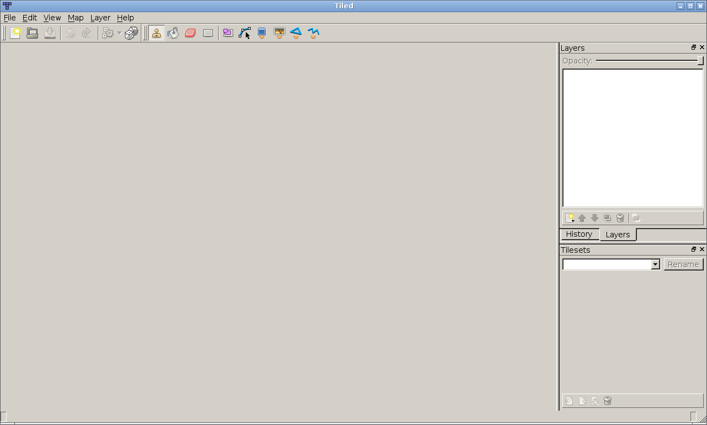

This is Tiled. It looks very simple because it is very simple. This chapter explains the features of Tiled, and its use in creating Tsunagari maps.

First, Tiled needs to be configured to produce files that Tsunagari can understand. Navigate to ``Edit > Preferences`` in the topbar menu.

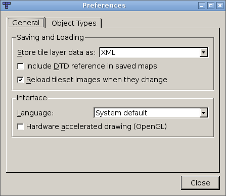

The options that need to be changed are under the "General" tab. In the newest version of Tiled, the required settings are as follows:

* Store tile layer data as: XML
* Include DTD reference in saved maps: OFF

Once the Preferences dialog is closed, Tiled should remember these settings.

Starting a New Map (Area)
=========================

After modifying Tiled's preferences, the next thing to do is create a new map. A map is a file that describes an "area" in Tsunagari. Each one represents a single area of the game world.

To create a new map, navigate to ``File > New`` in the topbar menu.

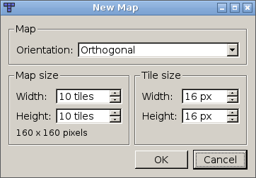

Make sure that "Orientation" is set to "Orthogonal", and that the "Tile Size" settings match with the size of the tiles in your tile sheets. "Map Size" is exactly what it sounds like; it sets the width and height of the new map in tiles.

.. image:: _static/tiled_04.png
	:scale: 25

Setting Map Properties
----------------------

Next we need to set some properties that Tsunagari will require in order to prepare the area for playing when it's loaded. "Properties" are data values left inside the TMX file for Tsunagari to read. Almost anything that can be modified with Tiled can have properties.

To set the map's properties, navigate to ``Map > Map Properties``.

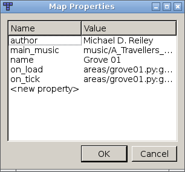

To add a new property, double click on "<new property>" under the name field. Once a property is added, you can set its value in the value field. The properties used in Tsunagari maps are as follows:

* "name": (**REQUIRED**) The name of the map area.
* "author": (**REQUIRED**) The name of the map's creator.
* "intro_music": (**OPTIONAL**) Path to a music file played exactly once when the area is entered.
* "main_music": (**OPTIONAL**) Path to a music file played continuously. Played after intro_music if it exists.
* "on_load": (**OPTIONAL**) Trigger for an event script or function to be run when the area first loads.
* "on_focus": (**OPTIONAL**) Trigger for an event script or function to be run each time the area is entered.
* "on_tick": (**OPTIONAL**) Trigger for an event script or function to be run every frame.
* "on_turn": (**OPTIONAL**) Trigger for an event script or function to be run every time the player moves in TURN mode. Different game modes are discussed later.
* "loop": (**OPTIONAL**) The looping area setting. Use "x" for a horizontal loop, "y" for a vertical loop, or "xy" for a full loop.
* "color_overlay": (**OPTIONAL**) Overlay a color onto the entire screen inside this area. Uses format "r,g,b,alpha".

The "intro_music" and "main_music" properties are persistent across all areas until redefined in the map properties of another area. In other words, any area without these properties will continue playing the music from before. Defining either of these properties with no value kills their music. A new "intro_music" property will start playing immediately.

Event script triggers always use one of two formats:

* "path/to/script.py": Run the specified script when the trigger is activated.
* "path/to/script.py:function()": Run the specified script and the specified function inside it when the trigger is activated. No arguments are accepted.

Custom map properties can also be set, and then read later with event scripting.

Tile Sheets
===========

Before you can place any tiles on your map, you have to link in a tile sheet. Tile sheets contain graphics for the tiles to be used in a map; they're described in more detail in the section on sprite and tile sheets in Chapter 2.

To link a tile sheet, navigate to ``Map > New Tileset`` in the topbar menu.

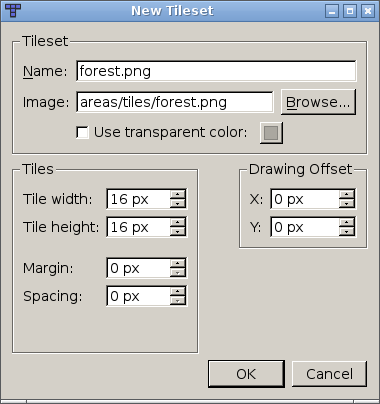

The "Name" field should contain the name of the tile sheet's image file, and the "Image" field should contain the file's path, relative to the top directory of your world. Absolute directories relative to your filesystem will not work.

The "Tile width" and "Tile height" fields should contain the width and height of the tiles in your tile sheet, in pixels.

The other options in this dialog are for specialized uses, and won't be discussed here. They are mostly self-explanatory, if needed.

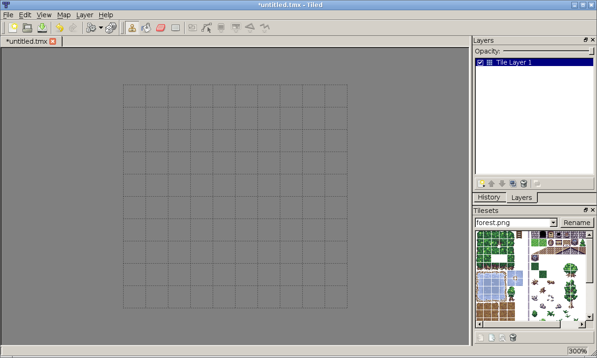

Once a tile sheet is linked in, its contents will appear in the "Tilesets" dialog in the bottom right of Tiled's window. This dialog is used for placing tiles and setting global tile properties. Multiple tile sheets may be linked, and they will all be usable from this dialog.

Global tile properties are properties that apply to every instance of that tile which is placed on the map. Tile properties in general are discussed across several later sections.

Animations
==========

Animations allow a tile in an area to cycle through several frames at a constant speed. They are usually set up as global tile properties. To create an animated tile, the properties must be added to the first tile in the animation, using the "Tilesets" dialog.

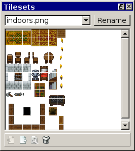

Right-click on the tile which will be the first frame of the animation, and select the ``Tile Properties`` option. To make this tile animated, set the following properties:

* "speed": An integer or decimal value -- speed of the animation in frames per second.
* "frames": A multi-ranged list of the numerical positions of the frames in this tile sheet. Example: "12,27,29-34,38". The first member of the list must be this tile. For more information on tile positions, see the chapter 2 section on sprite and tile sheets.
* "cycles": This property is **optional**. If set to a number greater than 0, the animation will cycle that many times before stopping on the last frame.

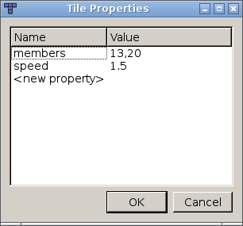

When the first tile in the animation is placed on the map, it will be animated in-game.

Layers
======

A layer is a subsection of a map, sharing the same x and y coordinates with all other layers, but having a different z coordinate. Tiles, entities, and other objects placed on higher layers are drawn above those on lower layers by the engine. In addition, properties, entities, and other objects on one layer do not have any affect on other layers. Tsunagari supports an infinite number of layers.

Upon creating a new map, one "tile layer" already exists. The existing layers are listed in the "Layers" dialog at the right of the Tiled window.

.. image:: _static/tiled_10.png

Before starting, we need to add a property to this layer to tell Tsunagari its z coordinate. To do so, right click on the layer's name, and select the ``Layer Properties`` option. (You can also rename the layer by double clicking its name, although the name is unimportant to the engine.)

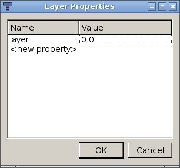

The layer's z coordinate is set in the "layer" property. Its value can be an integer or decimal number, positive or negative. The recommended starting layer for the player character is 0.

You can add a new tile layer by right clicking inside the dialog and selecting ``Add Tile Layer``. You can see that there is also an ``Add Object Layer`` option; this is described in a later section. After adding a new layer, don't forget to set its "layer" property.

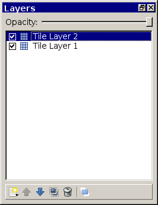

Note that in order for layers to display correctly in Tiled, they need to be kept in order in the dialog, top to bottom, based on their z coordinate. This can be done by clicking the layer's name and then clicking the up and down arrow buttons at the bottom of the layer dialog.

Layers can be used for scenery only, or they can be moved and interacted upon by entities or the player. There are three ways to move entities and the player between layers:

* Exits can move the player to an arbitrary x, y, and z coordinate on another map.
* Layermods can move the player or an entity to another z coordinate in-place.
* Event scripting can move the player or an entity anywhere.

These methods are described in later sections.

Placing Tiles
=============

So. We've walked through creating a new map, setting properties, adding tile sheets, and the basics of animations and layers. Now it's finally time to place some tiles on the map.

Click on the type of tile you want to place in the "Tilesets" dialog. The bucket fill tool is useful for placing the initial groundwork; it's available from the topbar.

Click anywhere on the map grid to fill the map. We'll place the floor at layer -0.1 -- the reasoning behind this will be explained in a moment. The layer can be selected for editing by clicking its name in the "Layers" dialog.

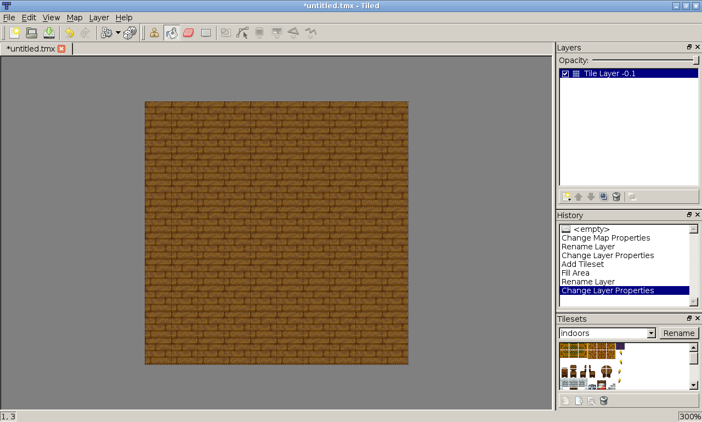

Now we'll add some walls. Use the stamp tool to place one tile at a time. Assuming that the player will start on layer 0, we should place the walls on or below that layer.

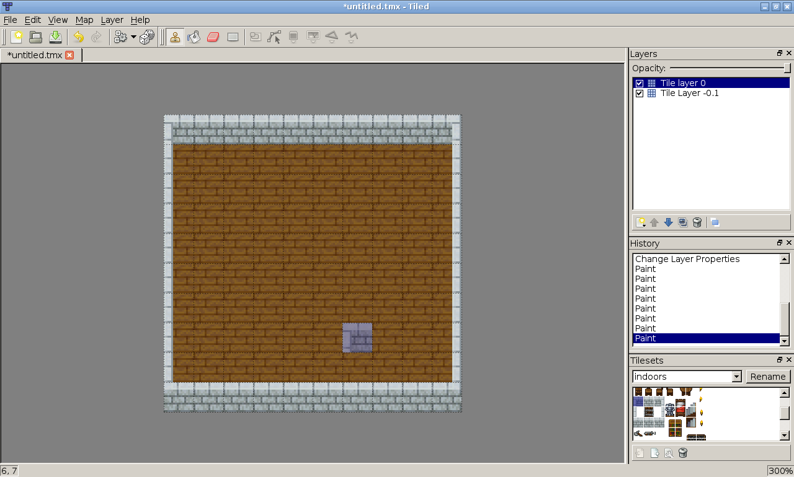

Tiles, such as walls, which are conceptually on the same level as an entity should usually not be on a layer above that entity. If the entity, such as the player, is taller than one tile, their top portion can disappear inside the wall when standing below it.

Now, let's place a nice rug in the middle. We can put this on the same layer as the wall. By holding the shift key, you can make a rectangular selection of tiles in the "Tilesets" dialog to be placed.

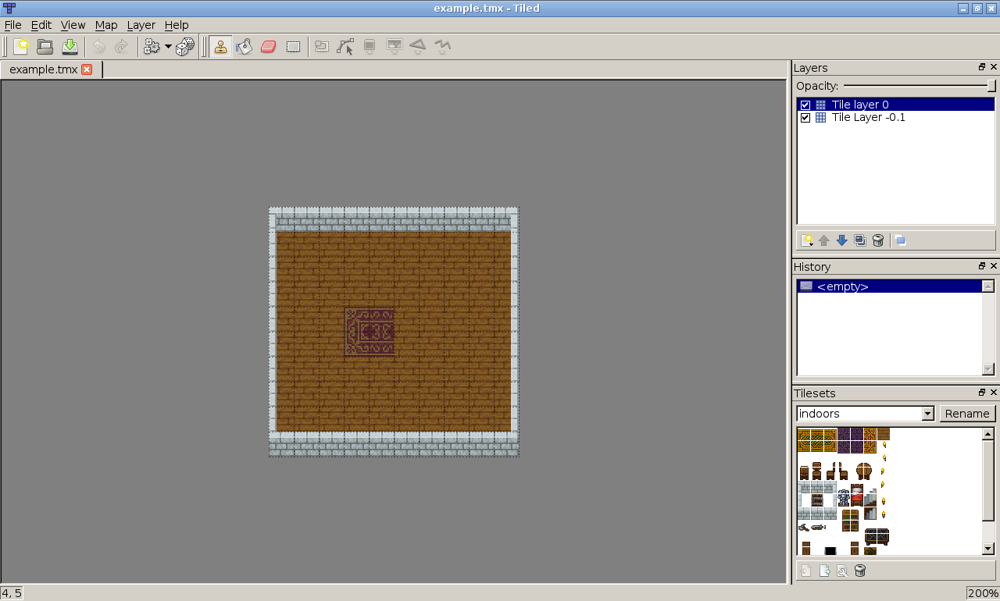

We now have a small basic map. Tiled has a bunch more features that are useful in this area, which can be found in its official documentation, or by just playing around.

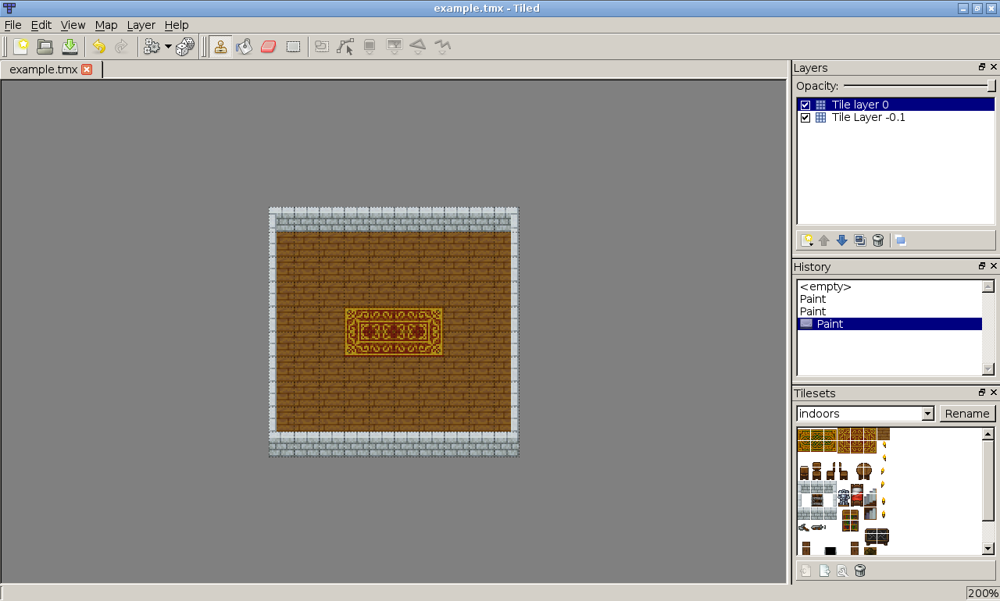

Placing Objects
===============

Tile Flags
==========

Event Triggers
==============

Layermod
========

Lazy Layermods
--------------

Linking Areas with Exits
========================

Lazy Exits
----------

Wide Exits
----------

